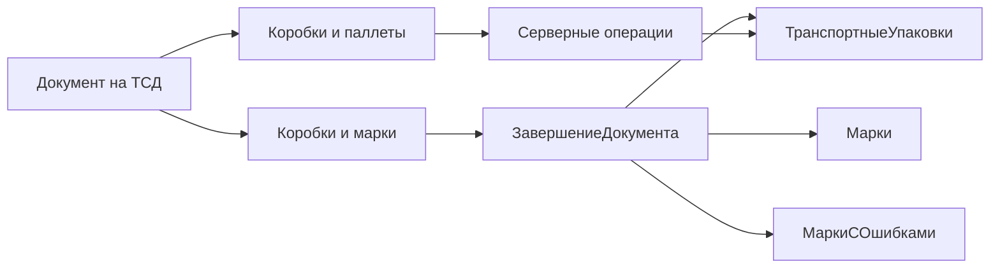

# Техническая документация

## Назначение

Документ «Итоговое задание» реализует двухуровневую агрегацию:

1. DataMatrix маркируемого товара → коробка (ТУ1).
2. Коробка (ТУ1) → паллета (ТУ2).

Работа с товарами выполняется в строках документа. Общий реестр упаковок и результаты завершённых документов хранятся на сервере Mobile SMARTS.

## Формат транспортных упаковок

Штрихкод транспортной упаковки состоит из семи цифр: `00` + признак уровня + четыре цифры.

- паллета: третья цифра равна `1`, например `0011111`;
- коробка: третья цифра не равна `1`, например `0000001`.

Проверки формата реализованы в `src/metadata/domain.erst`.

## Компоненты

| Файл | Ответственность |
|---|---|
| `src/documents/core/` | тип документа, главное меню и выход |
| `src/documents/boxes/` | настройки, сканирование и просмотр коробок |
| `src/documents/pallets/` | сборка паллет и просмотр набранного |
| `src/operations/packages/` | поиск упаковок и назначение паллет |
| `src/operations/completion/` | обработка завершённого документа |
| `src/metadata/domain.erst` | тип транспортной упаковки и проверка штрихкодов |
| `src/metadata/settings.erst` | настройка глубины коробок |
| `src/metadata/tables.erst` | серверные таблицы |
| `src/global.erst` | дополнительные поля строк документа |
| `.project/Settings_Default/ServerEvents.xml` | привязка события завершения документа |

## Данные документа

Каждая строка товара хранит:

| Поле | Назначение |
|---|---|
| `GTIN` | идентификатор товара из DataMatrix |
| `SerialNumber` | серийный номер марки |
| `SSCC` | штрихкод коробки |
| `PalletBarcode` | штрихкод родительской паллеты |
| `BoxClosed` | признак закрытой коробки |

## Серверные таблицы

### `ТранспортныеУпаковки`

| Поле | Назначение |
|---|---|
| `ШКТУ` | первичный ключ упаковки |
| `Родитель` | паллета, в которую входит коробка |

### `Марки`

Содержит уникальные пары `SN` + `GTIN` и штрихкод коробки.

### `МаркиСОшибками`

Содержит конфликтные пары `SN` + `GTIN`, повторно обнаруженные в другой коробке, а также коробку и паллету текущего документа.

## Основные процессы

### Сборка коробки

1. Пользователь сканирует коробку.
2. Проверяется формат ТУ1, наличие коробки в документе и на сервере.
3. Для новой коробки сканируются DataMatrix.
4. Из марки извлекаются GTIN и серийный номер; товар ищется в справочнике.
5. Марка сразу добавляется в список текущей коробки.
6. При достижении настройки `ГлубинаКоробок` коробка закрывается автоматически.

Повторная марка открывает карточку существующей строки. Из карточки можно удалить товар. Коробку можно очистить целиком после подтверждения.

### Сборка паллеты

1. Пользователь сканирует паллету.
2. В список загружаются коробки текущего документа и ранее привязанные серверные коробки.
3. Коробка ищется сначала в документе, затем отдельной серверной проверкой.
4. Для серверной коробки без паллеты записывается текущий родитель.
5. Перемещение с другой паллеты требует подтверждения.
6. Повторное сканирование текущей паллеты закрывает её.

При сканировании другой паллеты предлагается закрыть текущую и сразу открыть новую.

### Завершение документа

Событие завершения вызывает серверную операцию `ЗавершениеДокумента`:

- коробки записываются или обновляются в `ТранспортныеУпаковки`;
- новые марки добавляются в `Марки`;
- повторная обработка той же марки в той же коробке не создаёт дубль;
- марка, обнаруженная в другой коробке, удаляется из `Марки` и записывается в `МаркиСОшибками`.

Пустой документ при завершении удаляется без выгрузки на сервер.

## Сборка и проверка

- `Erston: Build and publish` — собрать и опубликовать конфигурацию.
- `F5` — собрать проект и запустить эмулятор ТСД.

После публикации уже запущенный эмулятор следует перезапустить, чтобы он получил обновлённую конфигурацию.
